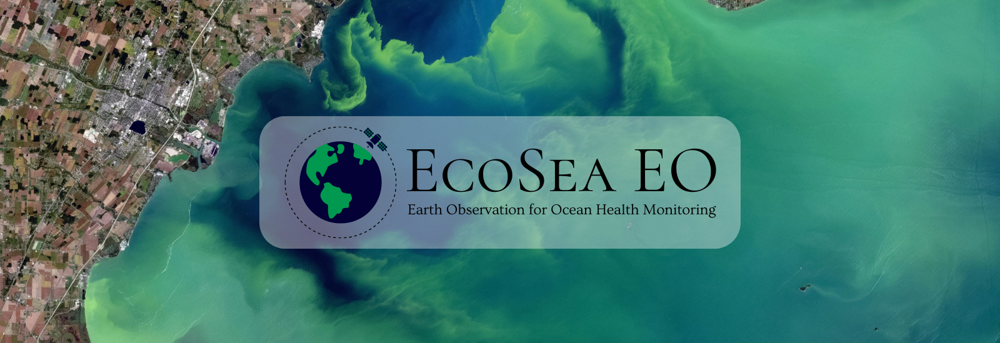
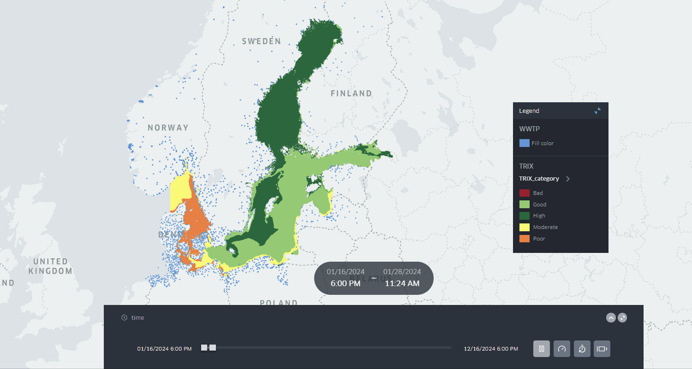
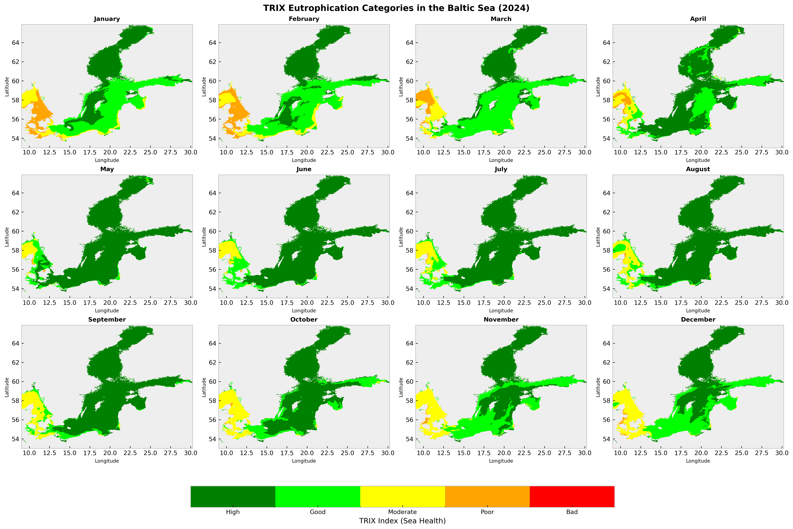
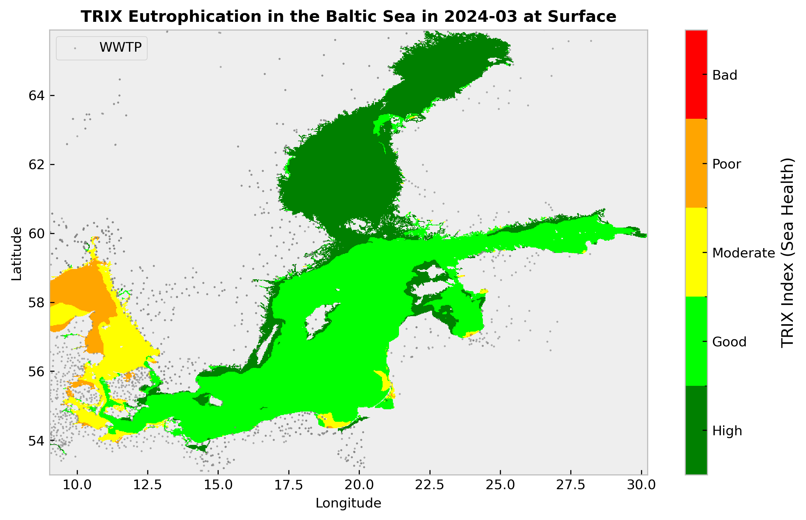
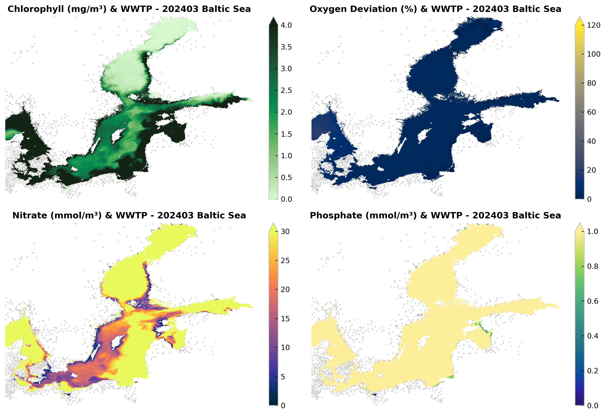

# 🌎**EcoSea EO**
## *Monitoring Eutrophication Impacts from Wastewater in the Baltic Sea*

EcoSea EO is a cloud-based monitoring system that overlaps Wastewater Treatment Plant-WWTP discharges with near-real-time eutrophication indicators in the Baltic Sea. Using the Copernicus Marine Service API and Blue Cloud Vlabs data, the TRIX indicator is automatically calculated from chlorophyll, dissolved nitrogen, phosphorus, and oxygen layers.

By mapping these TRIX outputs alongside WWTP discharge points (EMODnet), the system highlights seasonal hotspots of nutrient accumulation and oxygen depletion linked to point sources. This allows authorities and operators to track the impact of WWTPs, detect leakage or illegal dumping, and identify areas where stricter nutrient limits are needed.

In practice, EcoSea EO acts as an early-warning and decision-support tool, enabling regulators to set adaptive discharge thresholds, prevent harmful algal blooms, and safeguard water quality as climate change increases eutrophication risks. By doing so, EcoSea EO not only strengthens water quality management but also contributes to conserving marine wildlife, protecting vulnerable habitats, and reducing the broader impact of human wastewater discharges on ocean health.

## *What is this notebook for?*

This Jupyter Notebook is a deliverable for the Blue Cloud Hackathon 2025. It demonstrates the application of the TRIX indicator to assess eutrophication in the Baltic Sea. The analysis highlights the impact of wastewater on the marine environment and serves as a proof of concept for the proposed solution, EcoSea EO. The tool can be further developed or adopted by the scientific community to support ongoing efforts in ocean health monitoring and conservation.

## *Resources*

This analysis uses datasets from Copernicus Marine Service and algorithms from Blue Cloud Virtual Labs - Eutrophication. Find them listed next:

- TRIX Eutrophication Indicator from [VLab Marine Environmental Indicators 🔗](https://blue-cloud.org/virtual-labs/marine-environmental-indicators)
- Baltic Sea Biogechemistry Analysis and Forecast - **N, P, O, CHL** from [Copernicus Data Store - DOI:10.48670/moi-00009 🔗](https://data.marine.copernicus.eu/product/BALTICSEA_ANALYSISFORECAST_BGC_003_007/description) [Download 🔗](https://data.marine.copernicus.eu/product/BALTICSEA_ANALYSISFORECAST_BGC_003_007/files?subdataset=cmems_mod_bal_bgc_anfc_P1M-m_202411&path=BALTICSEA_ANALYSISFORECAST_BGC_003_007%2Fcmems_mod_bal_bgc_anfc_P1M-m_202411%2F2024%2F)
- Baltic Sea Physics Analysis and Forecast - **SST, Salinity** from [Copernicus Data Store - DOI:10.48670/moi-00010 🔗](https://data.marine.copernicus.eu/product/BALTICSEA_ANALYSISFORECAST_PHY_003_006/description) [Download 🔗](https://data.marine.copernicus.eu/product/BALTICSEA_ANALYSISFORECAST_PHY_003_006/files?subdataset=cmems_mod_bal_phy_anfc_P1M-m_202311&path=BALTICSEA_ANALYSISFORECAST_PHY_003_006%2Fcmems_mod_bal_phy_anfc_P1M-m_202311%2F2024%2F)
- Urban Wastewater Treatment Discharge Locations from [EMODNET Data Catalogue 🔗](https://emodnet.ec.europa.eu/geonetwork/srv/api/records/0bd23b5e-b288-4273-b8b7-d073538ada52) 

## *Online Demo*

Find an online Demo of the TRIX Eutrophication Indicator for the Baltic Sea. To have a light version running online this demo uses only **Surface** data.

- 🌎 [EcoSea EO Online Demo 🔗](https://gis4-wildlife.github.io/EcoSeaEO) Press ▶️ and interact!
- 💻 [Code 🔗](https://github.com/gis4-wildlife/EcoSeaEO) Available also in Blue Cloud Vlab!

 

## *Content*

This Notebook is divided into 3 sections that make the analysis smooth, understandable, and reproducible.

1. Calculating TRIX at monthly level in the Baltic Sea
2. Automate TRIX calculation during yearly seasonality
3. Visualization of Eutrophication seasonality with WWPT

## *Data layers*

Find the ecogeographical layers for this notebook in the folder ``Data``. The directory contains different datasets and it is structured like:

- ``Data/Copernicus_biogeochem`` - Contains Phytoplankton, Nitrates, Phosphates, and Oxygen of the Baltic Sea - Monthly 2024
- ``Data/Copernicus_physics`` - Contains potential temperature (SST) and salinity of the Baltic Sea - Monthly 2024
- ``Data/Emodnet_wwtp`` - Contains urban wastewater treatment discharge location of the Baltic Sea - Updated 2025

## *How to run*

Simply, run all cells of this notebook. Be sure that you have all the data loaded in the data folders as explained above. Then, check the results as explaned below. If you want to have more monthly maps just set up the month in section 1, then run all again. The section 2 will not repeat if products were generated previously. To save time!

## *Outputs*

The outputs are generated in the folders as next:

- ``Maps``: Maps of the variables used to calculate TRIX, monthly ❗Section 1. Per month.
- ``Maps_TRIX``: Maps of TRIX Eutrophication, monthly ❗Section 1. Per month.
- ``TRIX_results``: TRIX in NetCDF for Baltic Sea all depths, monthly
- ``TRIX_surface_demo``: TRIX in NetCDF and Parquet for online demo
- ``TRIX_seasonality_BalticSea_2024.png``: 12 monthly maps with TRIX in Baltic Sea
- ``index.html``: Map animation with TRIX seasonality

### TRIX Seasonality for 2024

### Trix and biogeochemistry variables

## *Authors*

This solution proposal was handled to *Blue Cloud Hackathon 2025* and created by the *EcoSea EO* Team lead by Bryan R. Vallejo - Geospatial Scientist from GIS4 Wildlife.

